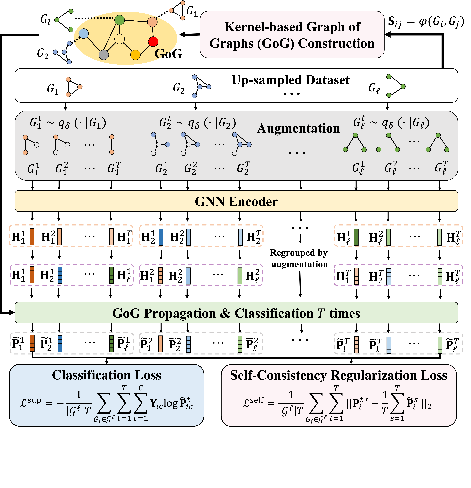

# G2GNN
This repository is an official PyTorch(Geometric) implementation of G^2GNN in "Imbalanced Graph Classification via Graph-of-Graph Neural Networks"




## Requirements
* PyTorch 1.10.0+cu113
* PyTorch Geometric 2.0.2
* Pytorch-scatter 2.0.9
* NetworkX 2.6.3
* Tqdm 4.62.3
* Sklearn 1.0.1

Note that the version of PyTorch and PyTorch Geometric should be compatible and PyTorch Geometric is related to other packages, which requires to be installed beforehand. It is recommended to follow the [installation instruction](https://pytorch-geometric.readthedocs.io/en/latest/notes/installation.html#).

## Run
* To reproduce the performance comparison and the ablation study in the following Table and the Figure, run
```linux
bash run.sh
```


