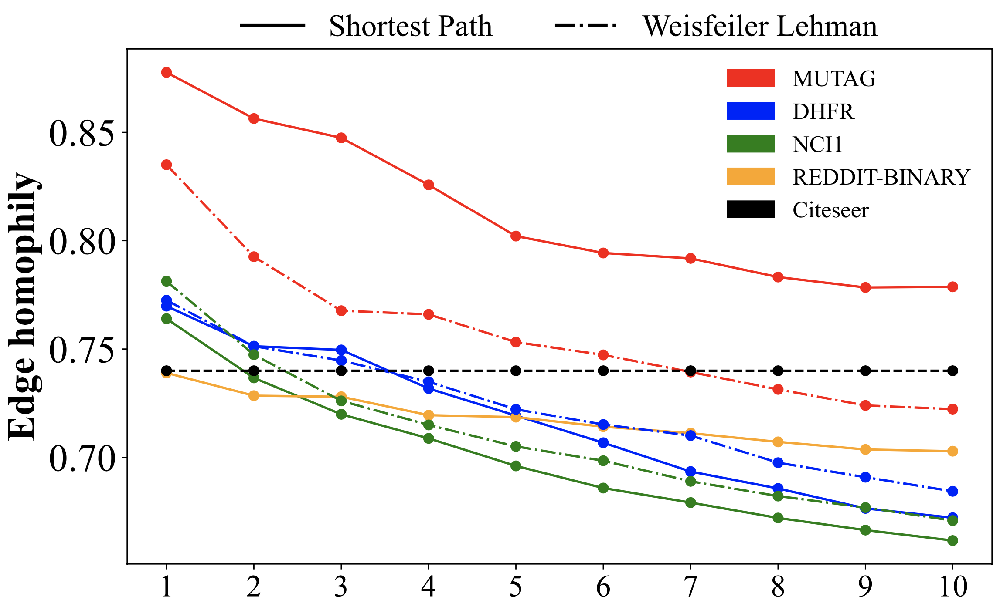
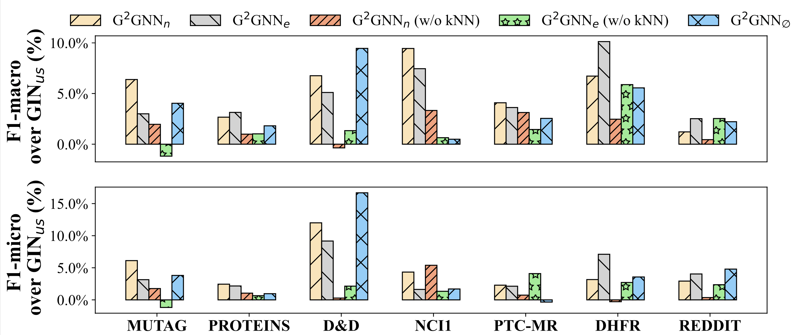

This repository is an official PyTorch(Geometric) implementation of G^2GNN in "Imbalanced Graph Classification via Graph-of-Graph Neural Networks". The whole flowchart our model is visualized in the sequal.


We provide the motivation of graph of graphs via computing the homophily level of each constructed graph with different r-top similar graphs as direct neighborhoods. We can clearly see that edge homophily decreases as r increases because graphs with low topological similarity have higher chance to be selected as neighborhoods while they likely belong to different classes from corresponding center graphs. However, edge homophily even with r up to 5 is still [0.7, 0.8] and comparable to Citeseer dataset, indicating most edges in the constructed graphs connects graphs of the same class. Motivated by this observation, we perform GoG propagation on the generated kNN graph to aggregate neighboring graph information.




## Requirements
* PyTorch 1.10.0+cu113
* PyTorch Geometric 2.0.2
* Pytorch-scatter 2.0.9
* NetworkX 2.6.3
* Tqdm 4.62.3
* Sklearn 1.0.1

Note that the version of PyTorch and PyTorch Geometric should be compatible and PyTorch Geometric is related to other packages, which requires to be installed beforehand. It is recommended to follow the [installation instruction](https://pytorch-geometric.readthedocs.io/en/latest/notes/installation.html#).

## Run
* To reproduce the performance comparison and the ablation study in the following Table and the Figure, run
```linux
bash run_{dataset}.sh
```


